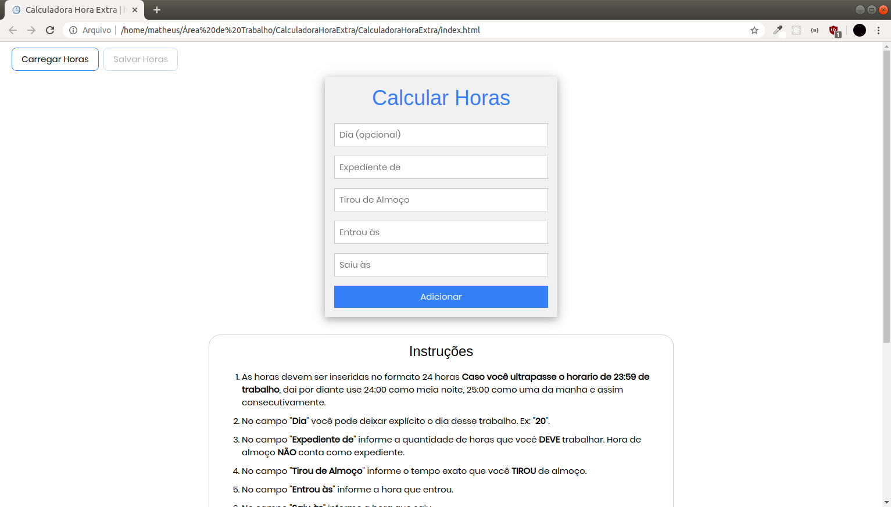
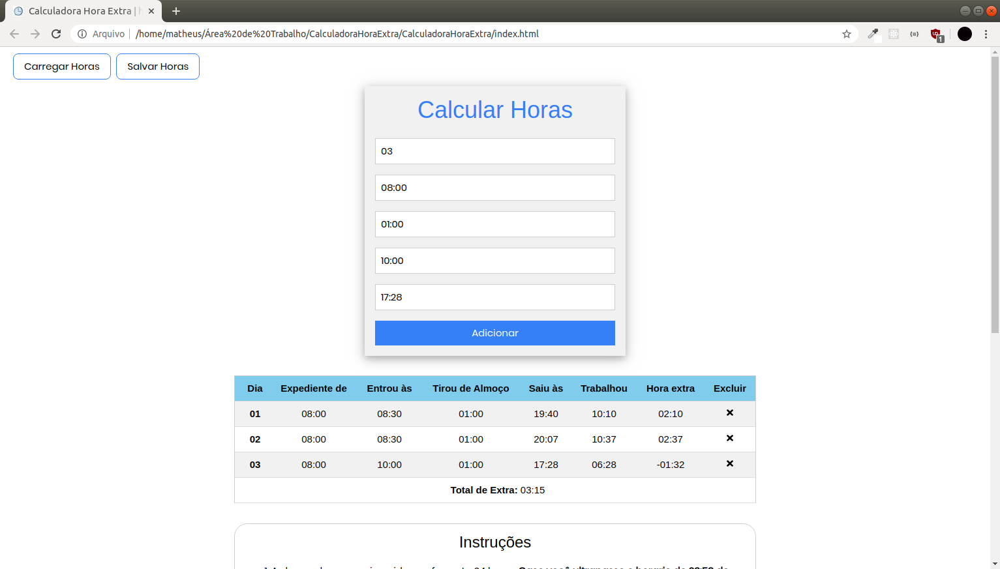

## Introdução
Projeto para calcular horas extras. Estava procurando projetos para me desafiar um pouco, então Fiz esse projeto como um desafio pessoal, e tem desafio melhor do que trabalhar com horas? hahaha ;D

## Desenvolvimento
Bom, o sistema é acumulativo, então você consegue calcular vários dias de trabalho e ver seu total de extra em uma tabela bem intuitiva e fácil de entender. É importante destacar que o sistema tambem informa se você está devendo horas, caso esteja ele vai colocar um sinal de negativo(-) que ai vai passar a representa a quantidade de horas que você está devendo.

Você consegue `salvar`, `carregar` e `excluir` suas horas, ao salvar vai iniciar um download de um arquivo JSON, esse arquivo contem suas horas e é ele que você vai usar para carregar suas horas no sistema da próxima vez que entrar, na tabela de horas você consegue excluir os dias que quiser apenas clicando no (x).

Você tambem vai encontrar algumas informações como as `instruções` e algumas `dicas` para calcular valores de extra.

Olha a cara dele ai:

Utilizando:

## Instruções (IMPORTANTE)
- As horas devem ser inseridas no formato 24 horas <b>Caso você ultrapasse o horario de 23:59 de trabalho</b>, dai por diante use 24:00 como meia noite, 25:00 como uma da manhã e assim consecutivamente.

- No campo "<b>Dia</b>" você pode deixar explícito o dia desse trabalho. Ex: "<b>20</b>".

- No campo "<b>Expediente de</b>" informe a quantidade de horas que você <b>DEVE</b> trabalhar. Hora de almoço <b>NÃO</b> conta como expediente.

- No campo "<b>Tirou de Almoço</b>" informe o tempo exato que você <b>TIROU</b> de almoço.

- No campo "<b>Entrou às</b>" informe a hora que entrou.

- No campo "<b>Saiu às</b>" informe a hora que saiu.

## Conclusão
Esse sistema tem algumas particularidades, então por favor leia as <b>instruções</b>.

Esse projeto foi bem interessante de fazer, eu trabalhei com muitas ferramentas que nunca havia trabalhado antes, como efetuar o download usando javascript, ferramenta do Google AdSense(o google não aceitou por propagandas no meu site por haver pouco conteudo hahaha, mas foi interessante ver como a ferramenta funciona) e trabalhar com horas tem seus desafios que foi legal de resolver.

link: [https://matheusfd3.github.io/calculadora-hora-extra/](https://matheusfd3.github.io/calculadora-hora-extra/)
